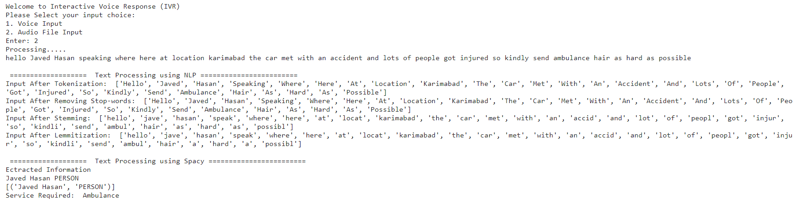

# Information-Extraction-for-Entity-Recognition

## Project Name: NLP Voice Input Processing for Emergency Services

## Project Description:
The NLP Voice Input Processing for Emergency Services project is a Python-based Natural Language Processing (NLP) application that converts voice input into text, recognizes gender through voice analysis, extracts vital information from the input, and generates an automatic voice reply for emergency situations when contacting ambulance, police, or firefighter services. The project leverages NLP techniques to facilitate efficient and accurate processing of voice data for emergency response scenarios.

### Output

 

## Key Features:

## Voice-to-Text Conversion:

Speech Recognition: The project employs speech recognition techniques to convert voice input into text, enabling the system to process and analyze spoken information effectively.
Audio Processing: The application handles audio streams or voice recordings, capturing and extracting the necessary data for further analysis.
Gender Recognition:

Voice Analysis: The project utilizes voice analysis algorithms to recognize the gender of the speaker based on the characteristics of their voice.
Gender Identification: By analyzing voice features, the system determines the gender of the speaker, facilitating personalized responses and tailored assistance.
Information Extraction:

Named Entity Recognition: The application utilizes Named Entity Recognition (NER) techniques to extract vital information such as user name, age, location, problem, requested service, and patient/incident condition from the voice input.
Contextual Analysis: The system processes the extracted information within the context of emergency services, ensuring the relevant details are identified and used for appropriate actions.
Automatic Voice Reply:

Emergency Situations: In emergency scenarios, the project generates an automatic voice reply for contacting ambulance, police, or firefighter services.
Quick Response: The system provides a prompt and customized voice response based on the extracted information, ensuring timely and accurate communication during critical situations.
Technologies and Techniques Used:

Python: The project is developed using Python programming language, leveraging its rich libraries and frameworks for speech recognition, NLP, and voice analysis.
Speech Recognition Libraries: The application utilizes speech recognition libraries such as SpeechRecognition or pocketsphinx to convert voice input into text.
Natural Language Processing: NLP techniques, including Named Entity Recognition (NER), are employed for information extraction from the voice input.
Gender Recognition Algorithms: The project uses voice analysis algorithms or machine learning models to recognize the gender of the speaker based on their voice characteristics.
The NLP Voice Input Processing for Emergency Services project showcases the utilization of NLP, speech recognition, and voice analysis to enable efficient processing of voice input during emergency situations. By converting voice into text, recognizing gender, and extracting vital information, the application ensures accurate and tailored responses when contacting ambulance, police, or firefighter services. This project aims to enhance the emergency response process by leveraging advanced technologies to provide prompt and appropriate assistance.
